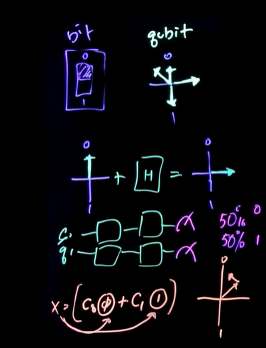
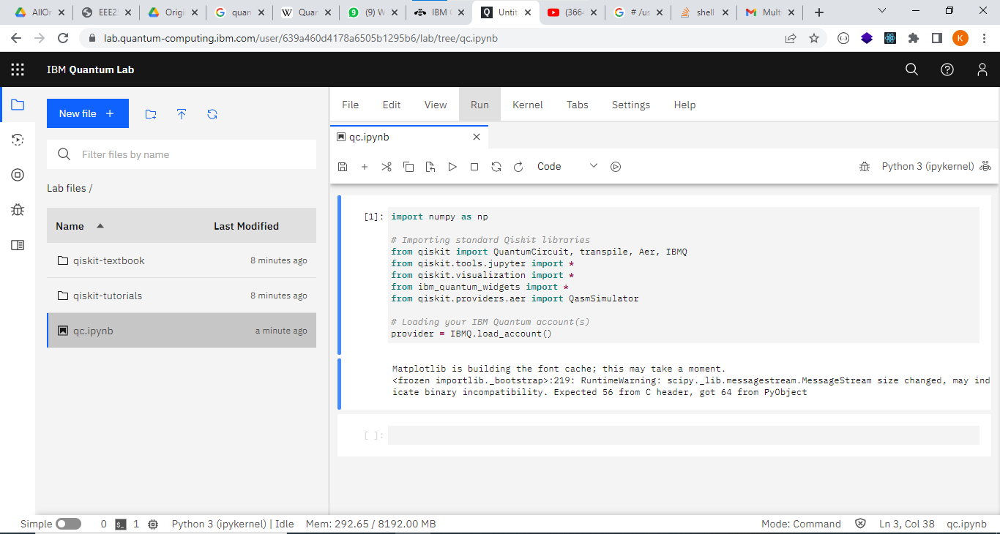
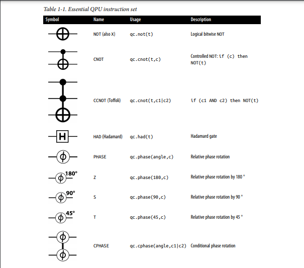
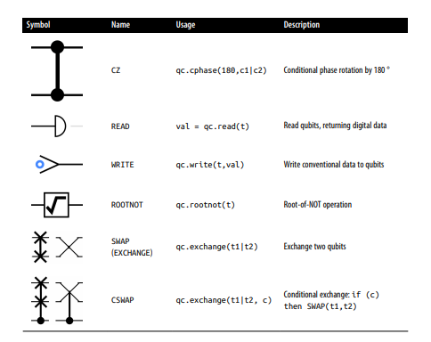
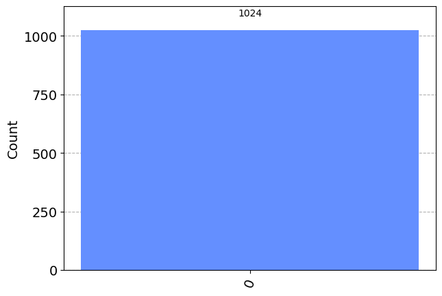
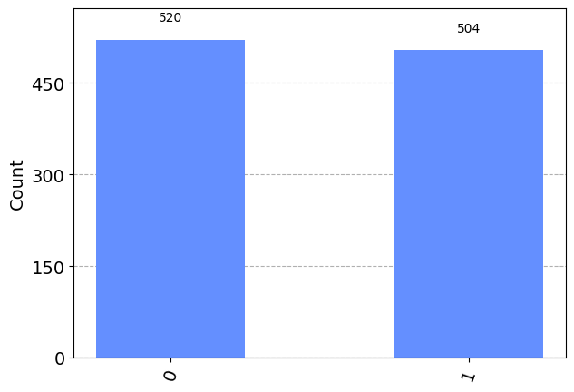
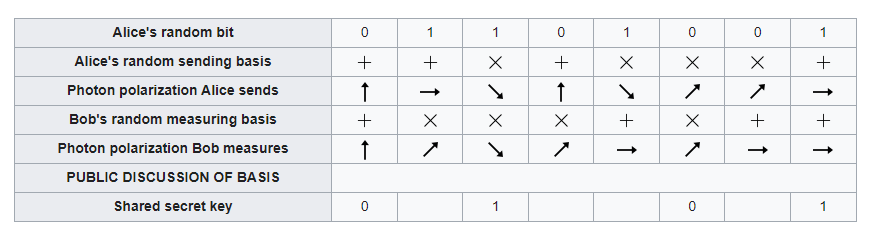
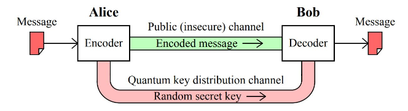
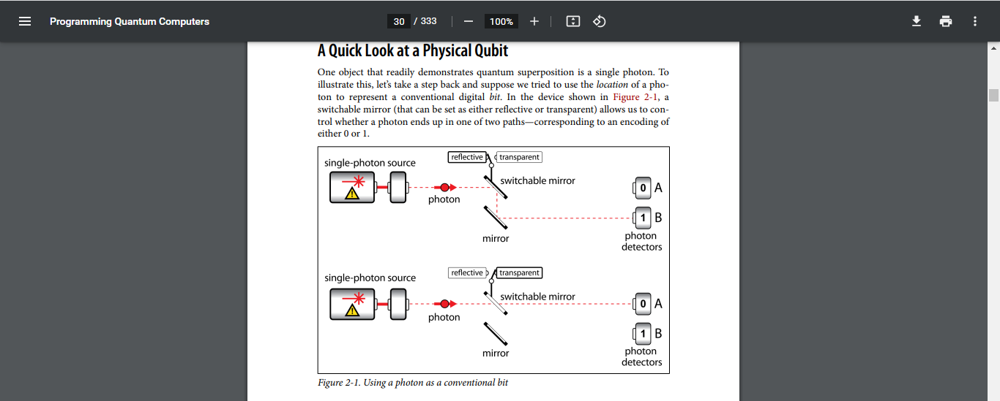
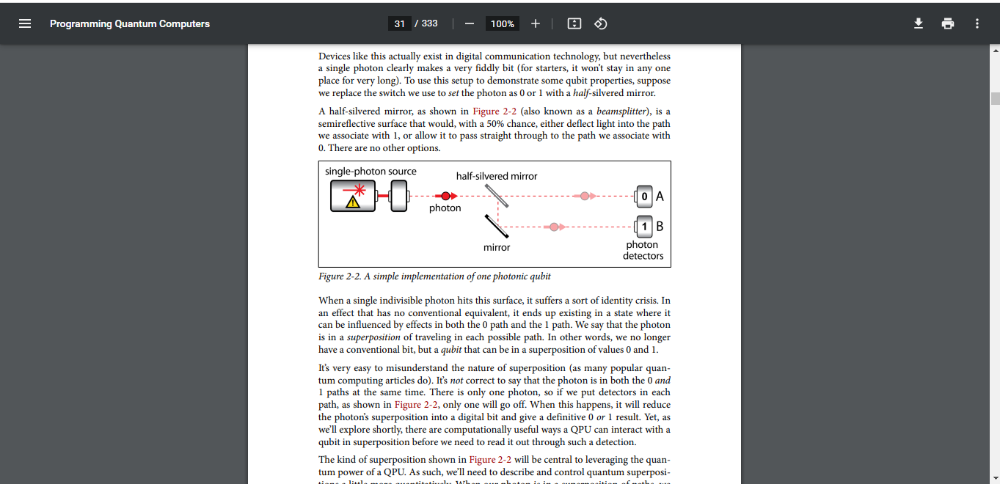

### The best known example of quantum cryptography is quantum key distribution which offers an information-theoretically secure solution to the key exchange problem. The advantage of quantum cryptography lies in the fact that it allows the completion of various cryptographic tasks that are proven or conjectured to be impossible using only classical (i.e. non-quantum) communication. 

#### For example, it is impossible to copy data encoded in a quantum state. If one attempts to read the encoded data, the quantum state will be changed due to wave function collapse (no-cloning theorem). This could be used to detect eavesdropping in quantum key distribution (QKD).

##### The main breakthrough came when we realized that photons were never meant to store information, but rather to transmit it 
###### [Bennett, Charles H.; et al. (1992). "Experimental quantum cryptography". Journal of Cryptology. 5 (1): 3–28. doi:10.1007/bf00191318. S2CID 206771454.]

### Quantum Computers Foundational topics

Classical computers use bits, while quantum computers use ***qubits***

* ##### Superposition 
Qubit can take 0,1 or any linear combination of the two
* ##### Gates
Qubits are manipulated using gates
* ##### Measurement
When a qubit is measured it looses its superposition and becomes a simple 0 or 1
* ##### Intereference
A quantum state is a linear combination and 0 state and 1 state. A computation applied to a quantum state applies to 0 and 1 states thus parallel computation. But during measurement only result from one state is measured and quantum gates are arranged such that it amlifies the correct answer and cancels the wrong ones a process called interference.
* ##### Entanglement 
When qubits are entangled their states become extreemly correlated. Changing the state of one qubit changes the state of the other




##### Qiskit is IBM SDK for buidling quantum circuits and programs. Qiskit runtime runs and optimizes qiskit programs on real quantum computer service

##### Quantum computing LAB was created on IBM quantum Computing service. A snippet of the lab work is shown below



##### Qiskit instruction set




#### The teleportation task

1. ##### Creating the Entangled Pair
Using the ***had*** and ***cnot*** achieves an entangled pair

2. ##### Prepairing the payload
Alice can prepare the payload to be sent.
How she prepares it depends, of course, on the nature of the (quantum)   
information that she wants to send to Bob. She might write a value to   
the payload qubit, entangle it with some other QPU data, or even receive   
it from a previous computation in some
entirely separate part of her QPU

3. ##### Link the Payload to the Entangled Pair
The conditional nature of the CNOT operation can entangle
the states of two qubits.    
Alice now uses this fact to entangle her payload qubit with   
her half of the entangled pair she already shares with Bob

4. ##### Put the Payload into a Superposition
To make the link that Alice has created for her payload actually useful,   
she needs to finish by performing a HAD operation on her payload,

5. ##### READ Both of Alice’s Qubits
As we’ll see, it turns out that the results of this unavoidably    
destructive READ operation are crucial for the telepor‐tation protocol to work.    
Copying quantum states is not possible, even when using entanglement. The only    
option to communicate quantum states is to teleport them, and when teleporting,    
we must destroy the original

6. ##### Receive and Transform
Bob now holds a qubit indistinguishable
from Alice’s initial payload.

7. ##### Verify the Result
By reading Bob's final qubit value received


```python
# COLAB = False

# if COLAB:
#     !pip install qiskit
# else:
#     !pip install qiskit
```


```python
from qiskit import QuantumCircuit, Aer, transpile, assemble
from qiskit.visualization import plot_histogram, plot_bloch_multivector
from numpy.random import randint
import numpy as np
```


```python
Aer.backends()
```


    [AerSimulator('aer_simulator'),
     AerSimulator('aer_simulator_statevector'),
     AerSimulator('aer_simulator_density_matrix'),
     AerSimulator('aer_simulator_stabilizer'),
     AerSimulator('aer_simulator_matrix_product_state'),
     AerSimulator('aer_simulator_extended_stabilizer'),
     AerSimulator('aer_simulator_unitary'),
     AerSimulator('aer_simulator_superop'),
     QasmSimulator('qasm_simulator'),
     StatevectorSimulator('statevector_simulator'),
     UnitarySimulator('unitary_simulator'),
     PulseSimulator('pulse_simulator')]


```python
# 1, quantum register, 1 classical register

qc = QuantumCircuit(1, 1)

# Preparation of Alice's (Voter) qubit in state |+>
qc.h(0) # hadarmad gate, allow quantum state to be measured as 50% 0 0r 1

qc.barrier()

# Bob (Admin) receives the qubit and measures it in the X-basis
qc.h(0)
qc.measure(0, 0)

display(qc.draw())
simulator = Aer.get_backend('aer_simulator')
job = simulator.run(assemble(qc))
plot_histogram(job.result().get_counts())
```


<pre style="word-wrap: normal;white-space: pre;background: #fff0;line-height: 1.1;font-family: &quot;Courier New&quot;,Courier,monospace">     ┌───┐ ░ ┌───┐┌─┐
  q: ┤ H ├─░─┤ H ├┤M├
     └───┘ ░ └───┘└╥┘
c: 1/══════════════╩═
                   0 </pre>


    

    


```python
qc = QuantumCircuit(1, 1)

# Preparation of Alice's qubit in state |+>
qc.h(0)

# Alice sends the qubit to Bob. However, Eve taps into the system and intercepts the message
qc.measure(0, 0)
qc.barrier()

# Eve, after getting the message, passes it to Bob who still measures it in the X-basis
qc.h(0)
qc.measure(0, 0)

display(qc.draw())
simulator = Aer.get_backend('aer_simulator')
job = simulator.run(assemble(qc))
plot_histogram(job.result().get_counts())
```


<pre style="word-wrap: normal;white-space: pre;background: #fff0;line-height: 1.1;font-family: &quot;Courier New&quot;,Courier,monospace">     ┌───┐┌─┐ ░ ┌───┐┌─┐
  q: ┤ H ├┤M├─░─┤ H ├┤M├
     └───┘└╥┘ ░ └───┘└╥┘
c: 1/══════╩══════════╩═
           0          0 </pre>


    

    


#### Quantum Key Distribution with BB84 algorithm

- Step 1

Alice chooses a string of random bits, e.g.:   
1000101011010100
And a random choice of basis for each bit:   
ZZXZXXXZXZXXXXXX
Alice keeps these two pieces of information private to herself.

- Step 2

Alice then encodes each bit onto a string of qubits using the basis she chose;    
this means each qubit is in one of the states |0⟩ , |1⟩ , |+⟩ or |−⟩ , chosen at random.    
In this case, the string of qubits would look like
this:
    This is the message she sends to Bob.

- Step 3

Bob then measures each qubit at random, for example, he might use the bases:   
XZZZXZXZXZXZZZXZ
And Bob keeps the measurement results private.

- Step 4

Bob and Alice then publicly share which basis they used for each qubit.    
If Bob measured a qubit in the same basis Alice prepared it in, they use this to    
form part of their shared secret key, otherwise they discard the information for that bit.  



- Step 5

Finally, Bob and Alice share a random sample of their keys, and if the samples match,    
they can be sure (to a small margin of error) that their transmission is successful.





```python
np.random.seed(seed=0)
n = 100
alice_bits = randint(2, size=n)
print(alice_bits)
```

    [0 1 1 0 1 1 1 1 1 1 1 0 0 1 0 0 0 0 0 1 0 1 1 0 0 1 1 1 1 0 1 0 1 0 1 1 0
     1 1 0 0 1 0 1 1 1 1 1 0 1 0 1 1 1 1 0 1 0 0 1 1 0 1 0 1 0 0 0 0 0 1 1 0 0
     0 1 1 0 1 0 0 1 0 1 1 1 1 1 1 0 1 1 0 0 1 0 0 1 1 0]
    

This set of random bits is only known to Alice. Alice then encodes each bit on in the X or Z-basis at random,    
storing the choice of each qubit in alice_bases. In this case, a 0 means in "prepare in the Z-basis" and a 1 means "prepare in the X-basis"


```python

# An array is created stating which qubits are recorded in which bases
alice_bases = randint(2, size=n)
print(f"Alice's biases: {alice_bases}")
```

    Alice's biases: [1 0 0 1 0 0 0 1 1 0 1 0 0 0 0 0 1 0 1 0 1 1 1 1 1 0 1 1 1 1 0 1 1 0 0 1 0
     0 0 0 1 1 0 0 1 0 1 1 1 1 0 0 0 1 0 1 1 1 0 1 0 0 1 0 1 1 0 0 1 0 1 0 1 0
     1 0 1 0 0 0 1 0 1 0 1 0 0 0 0 0 1 0 0 1 0 0 0 1 0 0]
    

Alice also keeps this knowledge private. The function below creates a list of    
QuantumCircuits each representing a single qubit in Alice's message.


```python
def encode_message(bits, bases):
      message = []
      for i in range(n):
        qc = QuantumCircuit(1, 1)
        if bases[i] == 0: # Qubit prepared in Z-basis
          if bits[i] == 0:
            pass
          else: 
            qc.x(0)
        else: # Qubit prepared in X-basis
          if bits[i] == 0:
            qc.h(0)
          else:
            qc.x(0)
            qc.h(0)
        qc.barrier()
        message.append(qc)
      return message

message = encode_message(alice_bits, alice_bases)
print(message)
```

    [<qiskit.circuit.quantumcircuit.QuantumCircuit object at 0x00000206CA5D5450>, <qiskit.circuit.quantumcircuit.QuantumCircuit object at 0x00000206CA49C580>, <qiskit.circuit.quantumcircuit.QuantumCircuit object at 0x00000206CA49CAF0>, <qiskit.circuit.quantumcircuit.QuantumCircuit object at 0x00000206CA49EBC0>, <qiskit.circuit.quantumcircuit.QuantumCircuit object at 0x00000206CA49D780>, <qiskit.circuit.quantumcircuit.QuantumCircuit object at 0x00000206CA49C3A0>, <qiskit.circuit.quantumcircuit.QuantumCircuit object at 0x00000206CA49CC10>, <qiskit.circuit.quantumcircuit.QuantumCircuit object at 0x00000206CA49D2A0>, <qiskit.circuit.quantumcircuit.QuantumCircuit object at 0x00000206CA49DAE0>, <qiskit.circuit.quantumcircuit.QuantumCircuit object at 0x00000206CA49E860>, <qiskit.circuit.quantumcircuit.QuantumCircuit object at 0x00000206CA49FCD0>, <qiskit.circuit.quantumcircuit.QuantumCircuit object at 0x00000206CA49DA50>, <qiskit.circuit.quantumcircuit.QuantumCircuit object at 0x00000206CA49DB10>, <qiskit.circuit.quantumcircuit.QuantumCircuit object at 0x00000206CA49EA70>, <qiskit.circuit.quantumcircuit.QuantumCircuit object at 0x00000206CA49FAF0>, <qiskit.circuit.quantumcircuit.QuantumCircuit object at 0x00000206CA49F2E0>, <qiskit.circuit.quantumcircuit.QuantumCircuit object at 0x00000206CA49D150>, <qiskit.circuit.quantumcircuit.QuantumCircuit object at 0x00000206CA49F190>, <qiskit.circuit.quantumcircuit.QuantumCircuit object at 0x00000206CA49EE90>, <qiskit.circuit.quantumcircuit.QuantumCircuit object at 0x00000206CA454520>, <qiskit.circuit.quantumcircuit.QuantumCircuit object at 0x00000206CA457E80>, <qiskit.circuit.quantumcircuit.QuantumCircuit object at 0x00000206CA457550>, <qiskit.circuit.quantumcircuit.QuantumCircuit object at 0x00000206CA454100>, <qiskit.circuit.quantumcircuit.QuantumCircuit object at 0x00000206CA454B80>, <qiskit.circuit.quantumcircuit.QuantumCircuit object at 0x00000206CA457C10>, <qiskit.circuit.quantumcircuit.QuantumCircuit object at 0x00000206CA4566E0>, <qiskit.circuit.quantumcircuit.QuantumCircuit object at 0x00000206CA4552A0>, <qiskit.circuit.quantumcircuit.QuantumCircuit object at 0x00000206CA457460>, <qiskit.circuit.quantumcircuit.QuantumCircuit object at 0x00000206CA4564A0>, <qiskit.circuit.quantumcircuit.QuantumCircuit object at 0x00000206CA455BD0>, <qiskit.circuit.quantumcircuit.QuantumCircuit object at 0x00000206CA457790>, <qiskit.circuit.quantumcircuit.QuantumCircuit object at 0x00000206CA456470>, <qiskit.circuit.quantumcircuit.QuantumCircuit object at 0x00000206CA456680>, <qiskit.circuit.quantumcircuit.QuantumCircuit object at 0x00000206CA457F70>, <qiskit.circuit.quantumcircuit.QuantumCircuit object at 0x00000206CA457AF0>, <qiskit.circuit.quantumcircuit.QuantumCircuit object at 0x00000206CA457F40>, <qiskit.circuit.quantumcircuit.QuantumCircuit object at 0x00000206CA457B50>, <qiskit.circuit.quantumcircuit.QuantumCircuit object at 0x00000206CA4577F0>, <qiskit.circuit.quantumcircuit.QuantumCircuit object at 0x00000206CA457310>, <qiskit.circuit.quantumcircuit.QuantumCircuit object at 0x00000206CA457070>, <qiskit.circuit.quantumcircuit.QuantumCircuit object at 0x00000206CA456CE0>, <qiskit.circuit.quantumcircuit.QuantumCircuit object at 0x00000206CA456860>, <qiskit.circuit.quantumcircuit.QuantumCircuit object at 0x00000206CA456560>, <qiskit.circuit.quantumcircuit.QuantumCircuit object at 0x00000206CA4561A0>, <qiskit.circuit.quantumcircuit.QuantumCircuit object at 0x00000206CA455DE0>, <qiskit.circuit.quantumcircuit.QuantumCircuit object at 0x00000206CA455A80>, <qiskit.circuit.quantumcircuit.QuantumCircuit object at 0x00000206CA455660>, <qiskit.circuit.quantumcircuit.QuantumCircuit object at 0x00000206CA455300>, <qiskit.circuit.quantumcircuit.QuantumCircuit object at 0x00000206CA455000>, <qiskit.circuit.quantumcircuit.QuantumCircuit object at 0x00000206CA454C40>, <qiskit.circuit.quantumcircuit.QuantumCircuit object at 0x00000206CA454790>, <qiskit.circuit.quantumcircuit.QuantumCircuit object at 0x00000206CA454430>, <qiskit.circuit.quantumcircuit.QuantumCircuit object at 0x00000206CA454490>, <qiskit.circuit.quantumcircuit.QuantumCircuit object at 0x00000206CA1DA890>, <qiskit.circuit.quantumcircuit.QuantumCircuit object at 0x00000206CA1DA9B0>, <qiskit.circuit.quantumcircuit.QuantumCircuit object at 0x00000206CA1DBAC0>, <qiskit.circuit.quantumcircuit.QuantumCircuit object at 0x00000206CA1DAB60>, <qiskit.circuit.quantumcircuit.QuantumCircuit object at 0x00000206CA1D9570>, <qiskit.circuit.quantumcircuit.QuantumCircuit object at 0x00000206CA1DB550>, <qiskit.circuit.quantumcircuit.QuantumCircuit object at 0x00000206CA1D9180>, <qiskit.circuit.quantumcircuit.QuantumCircuit object at 0x00000206CA1D9C90>, <qiskit.circuit.quantumcircuit.QuantumCircuit object at 0x00000206CA1DBD00>, <qiskit.circuit.quantumcircuit.QuantumCircuit object at 0x00000206CA1D9F00>, <qiskit.circuit.quantumcircuit.QuantumCircuit object at 0x00000206CA1D9480>, <qiskit.circuit.quantumcircuit.QuantumCircuit object at 0x00000206CA1DAEC0>, <qiskit.circuit.quantumcircuit.QuantumCircuit object at 0x00000206CA1D9270>, <qiskit.circuit.quantumcircuit.QuantumCircuit object at 0x00000206CA1D8E20>, <qiskit.circuit.quantumcircuit.QuantumCircuit object at 0x00000206CA1DBD60>, <qiskit.circuit.quantumcircuit.QuantumCircuit object at 0x00000206CA1D95A0>, <qiskit.circuit.quantumcircuit.QuantumCircuit object at 0x00000206CA1DB5E0>, <qiskit.circuit.quantumcircuit.QuantumCircuit object at 0x00000206CA1DB4F0>, <qiskit.circuit.quantumcircuit.QuantumCircuit object at 0x00000206CA1DB820>, <qiskit.circuit.quantumcircuit.QuantumCircuit object at 0x00000206C8BB6EF0>, <qiskit.circuit.quantumcircuit.QuantumCircuit object at 0x00000206C8BB5D80>, <qiskit.circuit.quantumcircuit.QuantumCircuit object at 0x00000206C8BB7340>, <qiskit.circuit.quantumcircuit.QuantumCircuit object at 0x00000206C8BB6500>, <qiskit.circuit.quantumcircuit.QuantumCircuit object at 0x00000206CA404D00>, <qiskit.circuit.quantumcircuit.QuantumCircuit object at 0x00000206CA405A20>, <qiskit.circuit.quantumcircuit.QuantumCircuit object at 0x00000206CA4064D0>, <qiskit.circuit.quantumcircuit.QuantumCircuit object at 0x00000206CA405420>, <qiskit.circuit.quantumcircuit.QuantumCircuit object at 0x00000206CA407040>, <qiskit.circuit.quantumcircuit.QuantumCircuit object at 0x00000206CA406290>, <qiskit.circuit.quantumcircuit.QuantumCircuit object at 0x00000206CA4047F0>, <qiskit.circuit.quantumcircuit.QuantumCircuit object at 0x00000206CA406770>, <qiskit.circuit.quantumcircuit.QuantumCircuit object at 0x00000206CA405EA0>, <qiskit.circuit.quantumcircuit.QuantumCircuit object at 0x00000206CA4055D0>, <qiskit.circuit.quantumcircuit.QuantumCircuit object at 0x00000206CA4040A0>, <qiskit.circuit.quantumcircuit.QuantumCircuit object at 0x00000206CA406200>, <qiskit.circuit.quantumcircuit.QuantumCircuit object at 0x00000206CA404F70>, <qiskit.circuit.quantumcircuit.QuantumCircuit object at 0x00000206CA406410>, <qiskit.circuit.quantumcircuit.QuantumCircuit object at 0x00000206CA405270>, <qiskit.circuit.quantumcircuit.QuantumCircuit object at 0x00000206CA404F40>, <qiskit.circuit.quantumcircuit.QuantumCircuit object at 0x00000206CA406980>, <qiskit.circuit.quantumcircuit.QuantumCircuit object at 0x00000206CA405F90>, <qiskit.circuit.quantumcircuit.QuantumCircuit object at 0x00000206CA4073D0>, <qiskit.circuit.quantumcircuit.QuantumCircuit object at 0x00000206CA405CC0>, <qiskit.circuit.quantumcircuit.QuantumCircuit object at 0x00000206CA404040>, <qiskit.circuit.quantumcircuit.QuantumCircuit object at 0x00000206CA4061D0>, <qiskit.circuit.quantumcircuit.QuantumCircuit object at 0x00000206CA4072E0>, <qiskit.circuit.quantumcircuit.QuantumCircuit object at 0x00000206CA407EE0>]
    

The message of qubits is then sent to Bob over Eve's quantum channel.    
Bob then measures each qubit in the X or Z-basis at random and stores this information


```python
bob_bases = randint(2, size=n)
print(f"Bob biases: {bob_bases}")
```

    Bob biases: [1 0 1 0 0 1 1 0 0 0 1 1 0 0 0 0 0 1 0 1 0 0 0 1 1 1 0 0 1 1 1 1 0 0 0 1 1
     0 1 0 0 1 0 1 1 1 1 0 0 0 1 1 1 0 1 1 1 1 0 0 1 1 0 0 0 1 1 0 1 1 1 1 1 0
     0 0 1 0 1 0 1 1 0 0 0 1 0 0 1 1 1 1 0 1 0 0 0 0 1 1]
    

bob_bases stores Bob's choice for which basis he measures each qubit in.    
The function below applies the corresponding measurement and simulates the result of measuring each qubit.    
The measurement results are stored in bob_results


```python
def measure_message(message, bases):
  backend = Aer.get_backend('aer_simulator')
  measurements = []
  for q in range(n):
    if bases[q] == 0: # Measuring in Z-basis
      message[q].measure(0, 0)
    if bases[q] == 1: # Measuring in X-basis
      message[q].h(0)
      message[q].measure(0, 0)
    simulator = Aer.get_backend('aer_simulator')
    qobj = assemble(message[q], shots=1, memory=True)
    result = simulator.run(qobj).result()
    measured_bit = int(result.get_memory() [0])
    measurements.append(measured_bit)
  return measurements

bob_results = measure_message(message, bob_bases)
# print(bob_results)
```

The circuit in message[0] (which represents the 0th qubit) has had an X-measurement added to it by Bob


```python
message[6].draw()
```


<pre style="word-wrap: normal;white-space: pre;background: #fff0;line-height: 1.1;font-family: &quot;Courier New&quot;,Courier,monospace">     ┌───┐ ░ ┌───┐┌─┐
  q: ┤ X ├─░─┤ H ├┤M├
     └───┘ ░ └───┘└╥┘
c: 1/══════════════╩═
                   0 </pre>


Since Bob has by chance chosen to measure in the same basis Alice encoded the qubit in, Bob is guaranteed to get the result 0.    
For the 6th qubit (shown below), Bob's random choice measurement is not the same as Alice's and Bob's result has only a 50% chance of matching Alice's


```python
print(bob_results)
```

    [0, 1, 1, 1, 1, 0, 1, 1, 0, 1, 1, 0, 0, 1, 0, 0, 0, 0, 1, 1, 0, 0, 0, 0, 0, 1, 0, 1, 1, 0, 1, 0, 0, 0, 1, 1, 1, 1, 1, 0, 0, 1, 0, 0, 1, 1, 1, 1, 0, 0, 0, 1, 1, 1, 0, 0, 1, 0, 0, 0, 0, 0, 1, 0, 1, 0, 0, 0, 0, 1, 1, 1, 0, 0, 0, 1, 1, 0, 0, 0, 0, 0, 1, 1, 0, 1, 1, 1, 1, 1, 1, 1, 0, 0, 1, 0, 0, 0, 0, 0]
    

Bob keeps his results private
impliment a function for remove garbage to throw entries that do not match up


```python
def remove_garbage(alice_bases, bob_bases, bits):
  good_bits = []
  for q in range (n):
    if alice_bases[q] == bob_bases[q]:
      good_bits.append(bits[q])
  return good_bits
```

discard the bits that do not match up and use the legitimate ones


```python
alice_key = remove_garbage(alice_bases, bob_bases, alice_bits)
print(f"Alice's key: {alice_key}")
bob_key = remove_garbage(alice_bases, bob_bases, bob_results)
print(f"Bobs's key: {bob_key}")

```

    Alice's key: [0, 1, 1, 1, 1, 0, 1, 0, 0, 0, 0, 1, 0, 0, 0, 1, 1, 1, 0, 1, 0, 1, 1, 0, 1, 0, 0, 0, 0, 0, 0, 1, 0, 0, 1, 1, 0, 0, 0, 1, 1, 1, 1, 0, 0, 1, 0, 0]
    Bobs's key: [0, 1, 1, 1, 1, 0, 1, 0, 0, 0, 0, 1, 0, 0, 0, 1, 1, 1, 0, 1, 0, 1, 1, 0, 1, 0, 0, 0, 0, 0, 0, 1, 0, 0, 1, 1, 0, 0, 0, 1, 1, 1, 1, 0, 0, 1, 0, 0]
    

let us see bob's keys


comparing the keys randomly to see if any manipulation has occured


```python
def sample_bits(bits, selection):
  sample = []
  for i in selection:
    i = np.mod(i, len(bits))

    sample.append(bits.pop(i))
  return sample
```

broadcast the keys as they are already out there


```python
sample_size = 15
bit_selection = randint(n, size = sample_size)

bob_sample = sample_bits(bob_key, bit_selection)
print(f"bob's sample = {bob_sample}")
alice_sample = sample_bits(alice_key, bit_selection)
print(f"alice's sample = {alice_sample}")


```

    bob's sample = [0, 1, 0, 1, 1, 0, 0, 0, 0, 0, 0, 1, 0, 0, 0]
    alice's sample = [0, 1, 0, 1, 1, 0, 0, 0, 0, 0, 0, 1, 0, 0, 0]
    

check if the protocol worked correctly


```python
bob_sample == alice_sample
```


    True


##### With Interception
##### INTRODUCING THE EAVESDROPPER EVE!


```python
np.random.seed(seed=3)
alice_bits = randint(2, size=n)
alice_bases = randint(2, size=n)
message = encode_message(alice_bits, alice_bases)

eve_bases = randint(2, size=n )
intercepted_message = measure_message(message, eve_bases)
print(intercepted_message)
```

    [1, 1, 1, 1, 0, 0, 1, 0, 1, 1, 1, 1, 1, 1, 0, 1, 0, 0, 0, 0, 0, 0, 0, 0, 0, 1, 1, 0, 1, 0, 0, 1, 0, 1, 1, 0, 0, 1, 0, 1, 1, 0, 0, 1, 0, 1, 1, 1, 1, 1, 1, 1, 1, 0, 0, 0, 0, 0, 0, 0, 0, 0, 0, 1, 0, 1, 0, 0, 0, 1, 0, 0, 1, 1, 1, 1, 1, 1, 1, 1, 1, 1, 0, 1, 0, 1, 1, 1, 0, 0, 1, 0, 1, 0, 0, 1, 1, 0, 1, 1]
    

##### eve's choice of basis is different from alice, hence changing the qubit form |+> to random state in z-basis, with 50% probability of |0> or |1>


```python
message[0].draw()
```


<pre style="word-wrap: normal;white-space: pre;background: #fff0;line-height: 1.1;font-family: &quot;Courier New&quot;,Courier,monospace">     ┌───┐ ░ ┌─┐
  q: ┤ H ├─░─┤M├
     └───┘ ░ └╥┘
c: 1/═════════╩═
              0 </pre>


now, bob receives the qubits and measures them either way, as he is not aware yet that interception has occured
if he were to measure the quibits the same way alice prepared them, then he would be guaranteed to measure 0, but due to the tapping that has occured, it introduces a chance/probability of 1/2 of measuring 1


```python
np.random.seed(seed = 3)
alice_bits = randint(2, size=n)
alice_bases = randint(2, size=n)
message = encode_message(alice_bits, alice_bases)

eve_bases = randint(2, size=n )
intercepted_message = measure_message(message, eve_bases)

bob_bases = randint(2, size=n )
bob_results= measure_message(message, bob_bases)
message[0].draw()

```


<pre style="word-wrap: normal;white-space: pre;background: #fff0;line-height: 1.1;font-family: &quot;Courier New&quot;,Courier,monospace">     ┌───┐ ░ ┌─┐┌───┐┌─┐
  q: ┤ H ├─░─┤M├┤ H ├┤M├
     └───┘ ░ └╥┘└───┘└╥┘
c: 1/═════════╩═══════╩═
              0       0 </pre>


discard the useless bits after bits after comparing them (alice and bob)


```python
np.random.seed(seed = 3)
alice_bits = randint(2, size=n)
alice_bases = randint(2, size=n)
message = encode_message(alice_bits, alice_bases)

eve_bases = randint(2, size=n )
intercepted_message = measure_message(message, eve_bases)

bob_bases = randint(2, size=n )
bob_results= measure_message(message, bob_bases)

bob_key = remove_garbage(alice_bases, bob_bases, bob_results)
alice_key = remove_garbage(alice_bases, bob_bases, alice_bits)
```

comparing the bits at random to check for interception


```python
sample_size = 15
bit_selection = randint(n, size = sample_size)

bob_sample = sample_bits(bob_key, bit_selection)
print("bob's sample = " + str(bob_sample))
alice_sample = sample_bits(alice_key, bit_selection)
print("alice's sample = " + str(alice_sample))
```

    bob's sample = [1, 1, 1, 0, 0, 1, 0, 1, 0, 0, 0, 0, 0, 1, 0]
    alice's sample = [1, 1, 0, 0, 1, 0, 0, 0, 0, 0, 0, 1, 0, 0, 0]
    

check how the protocol behaved


```python
bob_sample == alice_sample
```


    False


#### Physical representation of a Qubit

  


